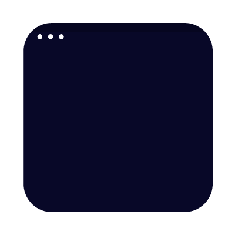

[](https://generalassemb.ly/education/web-development-immersive)

# HTML & CSS Layout

## Prerequisites

-    Basic knowledge of HTML
-    Basic knowledge of CSS

## Objectives

By the end of this talk, developers should be able to:

-   Explain the box model of element spacing.
-   Establish spacing inside and outside of elements using margin and padding.
-   Explain the difference between different types of distance measurement in a web
page, including 'px', '%', and 'em'.
-   Use Flexbox to create rich layouts.
-   Employ media queries to change CSS rules based on screen size.
-   Explain the difference between 'static' and 'fixed' positioning.

## Preparation

1.  Fork and clone this repository.
    [FAQ](https://git.generalassemb.ly/ga-wdi-boston/meta/wiki/ForkAndClone)
1.  Create three new branches, `training`, `flex-site`, and `lookalike-site`.
1.  Install dependencies with `npm install`.

## CSS Layout

So far, we've mostly talked about using CSS for styling our page - adding
colors, fonts, etc. In this talk, we'll be examining how CSS can be used to control a
webpage's layout.

Back in the day, web layout was achieved with just HTML, let's look at an
example of that, just for fun:
[# 90's CSS Example](https://www.warnerbros.com/archive/spacejam/movie/jam.html)

Today, layout is specified with CSS. It's easier, more modular, and it looks
much better too!

## Box Model

In addition to setting an element's `height` and `width`, elements have three
other properties that explicitly control spacing:

1.  'Border' sets a perimeter around an element. In addition to specifying a color
and a particular type of border, you can also specify a thickness.
2.  'Margin' specifies spacing between the outside of an element's border and any
adjacent elements.
3.  'Padding' specifies spacing between the inside of an element's border and the
contents of that element (which includes `height` and `width`!)

Together, these attributes form _the box model_, a way of describing the space
taken up by an element.

_Note: The Box Model explains how CSS `width` is Calculated. By default, how wide an element is on the page is a combination of `width` + `padding` + `border` and the rendered `height` = `height` + `padding` + `border`. This can be problematic when trying to create a layout or position things logically on the page._
_To calculate border, margin, and padding into the element's size, the element's CSS [`box-sizing`](https://developer.mozilla.org/en-US/docs/Web/CSS/box-sizing) property should be changed from the default `content-box` to `border-box.`_


Every one of these attributes, including `height` and `width`, can be specified
in the following terms:

-   `px` : fixed number of pixels.
-   `%`  : size is relative to element that contains it ("parent"). As a value of
`height`, `%` is relative to the parent's `height`, but for every other
dimension, `%` is relative to the parent's `width` value.
-   `em` : ties dimensions to *font size* - one `em` is the width of the letter 'm'.
For all dimensions except `font-size`, `em` will refer to the font size of the
element; as a value for `font-size`, `em` refers to the font size of the
*parent*.

## Flexbox

Block elements, as a rule, always stack vertically - never side by side. Each
block element effectively has a 'new-line' built into it, forcing the next piece
of content down.

This can be circumvented using a system called Flexbox. Officially called the
"Flexible Box Model", Flexbox is a relatively recent addition to CSS that makes
creating rich, responsive layouts much easier. Flexbox allows us to specify
whether the children of a given element should be arranged horizontally or
vertically, how they should be positioned along that axis, and how much space
they should take up.

A Flexbox layout therefore consists of two layers: the container element, which
we give the CSS properties `display: flex;` and `flex-direction: <direction>;`,
and the child elements, which will be arranged in that direction.

The most common choices for that `<direction>` will either be `row` or `column`.

If we choose, `flex-direction: row;` on the container element, its children will
be layed out like this:


If we choose `flex-direction: column;` we'll get this instead:


There's also a concept of a "cross axis", which is the axis perpendicular to
the one chosen by `flex-direction`:


We can use various other Flexbox properties to determine how elements are
positioned along both axes.

### Demo: Flex Properties

Let's take a look at [this Codepen](https://codepen.io/cpearce31/pen/djWBpJ) to
get a sense of the different layouts we can achieve with various flex
properties. We'll discuss what each property does and how it achieves the layout
that you see here.

### Code Along: Flexbox Demonstration

Working on our `training` branch, let's use the example HTML code to
demonstrate Flexbox.

First, we'll spin up our server, and see how things look currently. Not great,
right?

We've definitely got some work to do. Here's what we want our site to look
like:


To get there, we'll need to apply some of the flex properties we just saw in the
demo. Once we've achieved the desired layout, lets commit our changes.

### Lab: Box Model, Flexbox

Working with your squads on the `flex-site` branch, use
 [index.html](index.html) to create simple look-alikes that mimic the layout
(but **not** the actual content) of one of the following sites, using what
 you've learned about so far about CSS positioning (including margin, padding,
 and Flexbox).

-   [Boston Globe](http://bostonglobe.com)
-   [Wikipedia](http://en.wikipedia.org/wiki/Main_Page)
-   [Reddit](http://reddit.com)

#### Hints

1. Don't be afraid to 'cheat' by looking at the source code of the site you're mimicking.
2. Keep your sketches simple - don't add details like text, colors, etc.
3. When drawing boxes, try not to draw them flush against each other - adding a little bit of space helps to make it clear when boxes should be nested inside other boxes.
4. Don't got more than 4 levels deep in your nesting.
5. Bright colors for your divs help to make layout mistakes obvious.

## Media Queries

Using `%` dimensions allows you, to a certain degree, to account for a variety
of screen sizes by scaling up linearly. Sometimes, however, you don't want to
scale linearly; instead you want size to be fixed sometimes, to scale linearly
at others, or even to disappear entirely at a certain size.

Fortunately, CSS has a tool called a **media query** designed for this specific
use case.

```css
@media (max-width: 700px) {
  div {
    width: 300px;
    height: 300px;
  }
}
```

A media query acts a little like an `if` statement for your CSS; it will
_selectively hide or show_ the CSS it contains based on whether or not the
condition in the query comes back as `true`.

Media queries can often be thought of as blocks of CSS that override existing
styles from your stylesheet (although they can do much more than this). They,
therefore, are always placed at the bottom of your stylesheet.

Here are some properties that can be used to build media queries:

-   min-width: CSS is visible at all screen widths **larger** than the given value.
-   max-width: CSS is visible at all screen widths **smaller** than the given value.
-   min/max-resolution: CSS is visible above/below a given resolution.

### Lab: Media Queries

Revisit the basic site from the previous `flex-site` branch exercise, and add
a new effect that triggers when you shrink the screen below 800px wide.

## Static vs Fixed Positioning

All of the rules that you've learn so far are based on one paradigm of
positioning, called 'static' positioning. Static positioning is the default positioning model for elements. They are displayed in the page where they rendered as part of normal HTML flow.



Though there are others, the most significant type of positioning besides
`static` positioning is `fixed` positioning. `fixed` positioning defines the
position of an element with respect to the _view window_, essentially 'fixing'
its position on the screen. Fixed positioning is frequently used in parallax
scrolling, or for holding a navigation bar at the top/side/bottom of the screen.


### Lab: Static vs Fixed Positioning

Switch to the `lookalike-site` branch and work in your squads to create your own
 look-alike for the following websites. Try to use fixed positioning at least
once.

-   [You Tube](https://youtube.com)
-   [Twitter](https://twitter.com/GA)
-   [Artisan Asylum](http://artisansasylum.com/)

## Further Practice: Relative and Absolute Positioning

[Research](https://developer.mozilla.org/en-US/docs/Web/CSS/position) relative
 and absolute positioning in CSS. How are they used? A helpful reference for
understanding is [this CSS-tricks blog post](https://css-tricks.com/absolute-positioning-inside-relative-positioning/).

## Additional Resources:
- [Interactive CSS Intro](https://rupl.github.io/unfold/)
- [Interactive Box Model Demo](http://guyroutledge.github.io/box-model/)
- [CSS Positioning Explained By Building An Ice Cream Sundae](https://medium.freecodecamp.org/css-positioning-explained-by-building-an-ice-cream-sundae-831cb884bfa9)

## [License](LICENSE)

1.  All content is licensed under a CC­BY­NC­SA 4.0 license.
1.  All software code is licensed under GNU GPLv3. For commercial use or
    alternative licensing, please contact legal@ga.co.
